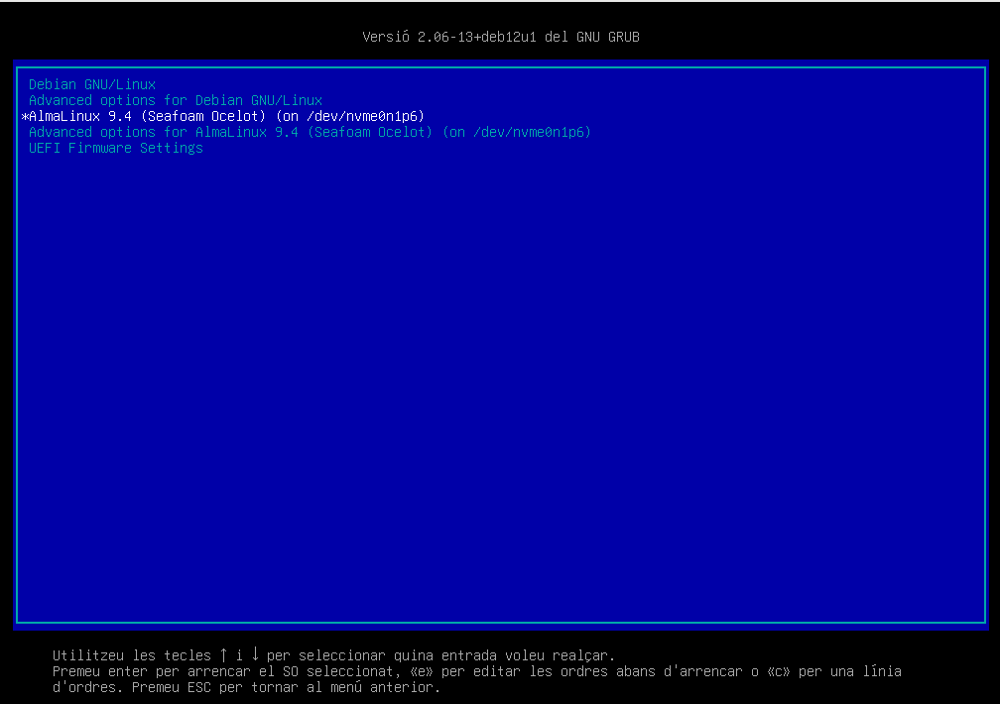

# Actualitzant el GRUB

Actualitzant el GRUB de debian per a mostrar l'entrada d'almalinux

1. Accedeix a la màquina virtual on tens instal·lat el teu Debian.
2. Accedeix a la consola del sistema operatiu.
3. Edita el fitxer de configuració del GRUB de debian amb un editor de text com `vi`.

    ```bash
    vi /etc/default/grub
    ```

4. Descomenta la línia `GRUB_DISABLE_OS_PROBER` i assigna-li el valor `false`.

    ```bash
    GRUB_DISABLE_OS_PROBER=false
    ```

5. Desa els canvis i tanca l’editor de text.
6. Actualitza el fitxer de configuració del GRUB amb la comanda següent:

    ```bash
    update-grub
    ```

7. Reinicia el sistema amb la comanda següent:

    ```bash
    reboot
    ```

8. Accedeix al GRUB de debian a través de la UEFI i comprova que ara pots seleccionar l’entrada d’almalinux.

    

> **Reflexió**: *Quin GRUB és millor?*
>
> Indiferent. Cada distribució GNU/Linux configura el GRUB de manera diferent per a adaptar-lo a les seves necessitats i requeriments. Això significa que cada distribució GNU/Linux pot tenir una configuració del GRUB diferent, amb diferents opcions i configuracions. La millor configuració del GRUB és aquella que millor s’adapta a les necessitats del teu sistema.
