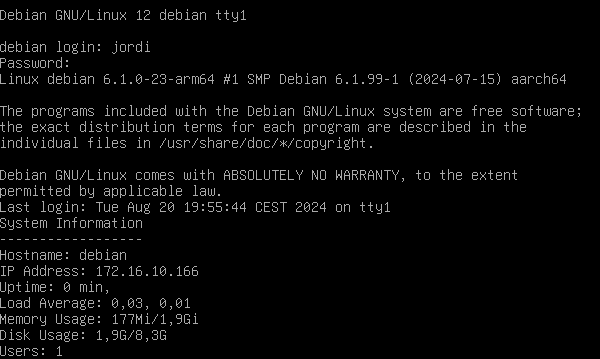
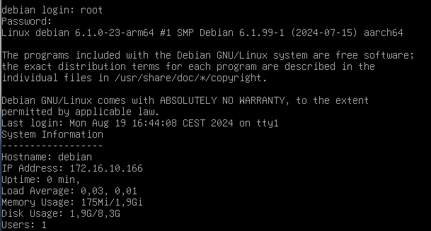

# Afegint informació d'inici

Els scripts d'arrancada en sistemes Unix i Linux són fitxers que s'executen automàticament quan un usuari inicia una sessió de terminal. Els scripts d'arrancada més comuns eni Linux són (per ordre d'execució):

1. `/etc/profile`: Script d'arrancada global per a tots els usuaris del sistema.
2. `/etc/profile.d/`: Directori que conté scripts d'arrancada addicionals.
3. `~/.bash_profile`: Script d'arrancada específic de l'usuari per a la shell bash.
4. `~/.profile`: Script d'arrancada específic de l'usuari per a la shell sh i altres shells compatibles.
5. `~/.bashrc`: Script d'arrancada específic de l'usuari per a la shell bash.
6. `/root/.profile`: Script d'arrancada específic de l'usuari root per a la shell sh i altres shells compatibles.

Aquests scripts s'executen en un ordre específic quan un usuari inicia una sessió de terminal. A continuació, veurem una descripció de cada script d'arrancada i el seu ús, així com l'ordre d'execució dels scripts d'arrancada. Per veure l'ordre d'execució dels scripts d'arrancada, podeu consultar el manual de `bash` amb la comanda `man bash` i buscar la secció "INVOCATION".

Anem a veure com podem mostrar informació sobre el servidor després de l'arrencada i el login de l'usuari. Aquesta informació pot ser útil per als administradors de sistemes per mostrar informació rellevant sobre el sistema, com ara la càrrega del sistema, l'ús de la CPU, la memòria disponible, la addresa IP i el nombre d'usuaris connectats.

1. **Crea un script d'informació del sistema**: Crea un script d'informació del sistema a `/etc/profile.d/system-info.sh` amb el següent contingut:

    ```bash
    #!/bin/bash

    # Informació del sistema
    echo "System Information"
    echo "------------------"
    echo "Hostname: $(hostname)"
    echo "IP Address: $(hostname -I | awk '{print $1}')"
    echo "Uptime: $(uptime | awk '{print $3 " " $4}')"
    echo "Load Average: $(uptime | awk '{print $10 " " $11 " " $12}')"
    echo "Memory Usage: $(free -h | grep Mem | awk '{print $3 "/" $2}')"
    echo "Disk Usage: $(df -h / | grep /dev | awk '{print $3 "/" $2}')"
    echo "Users: $(who | wc -l)"
    ```

    Aquest script mostra informació rellevant sobre el sistema, com ara el nom de l'amfitrió, la addresa IP, el temps d'activitat, la càrrega del sistema, l'ús de la memòria, l'ús del disc i el nombre d'usuaris connectats.

    Si posem l'script a `/etc/profile.d/` aquest s'executarà automàticament quan un usuari inicia una sessió de terminal. Això permet mostrar informació rellevant sobre el sistema després de l'arrencada i el login de l'usuari.

4. **Atorga permisos d'execució a l'script**:

    ```bash
    chmod +x /etc/profile.d/system-info.sh
    ```

5. **Reinicia el sistema**: Reinicia el sistema per aplicar els canvis.

    ```bash
    reboot
    ```

Un cop el sistema s'hagi reiniciat, podeu iniciar una sessió de terminal i veure la informació del sistema després de l'arrencada i el login de l'usuari. Aquesta informació us pot ajudar a monitoritzar l'estat del sistema i identificar problemes o errors.

- Inici de sessió amb un usuari normal:

    

- Inici de sessió com a usuari root:
  
    

> ℹ️ Diferencia entre .bashrc i .bash_profile?
>
> Si únicament voleu mostrar la informació del sistema quan s'inicia la sessió de l'usuari root, podeu afegir el script `system-info.sh` al fitxer `/root/.profile` en lloc de `/etc/profile.d/system-info.sh`. Això farà que la informació del sistema es mostri només quan s'inicia la sessió de l'usuari root.

> ℹ️ Diferencia entre .bashrc i .bash_profile?
>
> El fitxer `.bashrc` s'executa cada vegada que s'inicia una sessió de terminal, mentre que el fitxer `.bash_profile` s'executa només quan s'inicia una sessió de terminal interactiva. Això significa que el fitxer `.bashrc` s'executarà cada vegada que s'obri una nova finestra de terminal, mentre que el fitxer `.bash_profile` s'executarà només quan s'inicia una sessió de terminal interactiva. Per tant, si voleu mostrar la informació del sistema només quan s'inicia la sessió de l'usuari, podeu afegir el script al fitxer `.bash_profile` en lloc de `.bashrc`.
