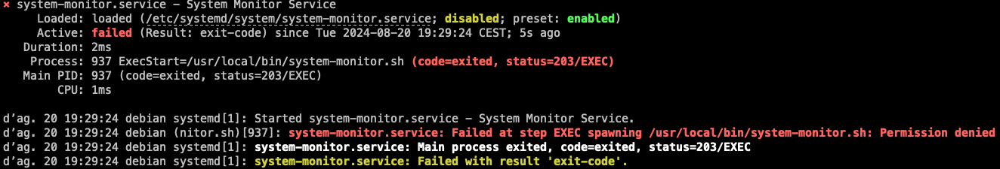
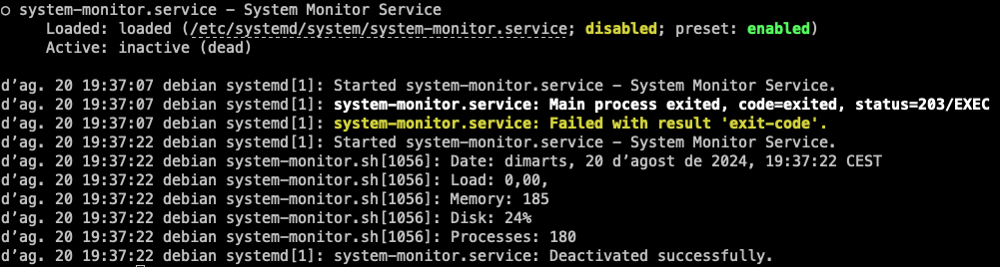

# Anàlisi de logs

Un altre eina útil que ens ofereix systemd és `journalctl`, que ens permet analitzar els registres del sistema. Aquesta eina ens permet veure els registres del sistema en temps real, buscar registres específics, filtrar registres per unitat, i molt més.

Crearem un servei amb bash i awk que monitoritzi l'estat del sistema i registri la informació en un fitxer de registre. A continuació, utilitzarem `journalctl` per analitzar els registres del sistema i buscar la informació del servei.

1. **Crea un script de monitoratge**:

    ```bash
    #!/bin/bash

    # Monitor the system state
    echo "Date: $(date)" 
    echo "Load: $(uptime | awk '{print $10}')" 
    echo "Memory: $(free -m | awk 'NR==2{print $3}')" 
    echo "Disk: $(df -h / | awk 'NR==2{print $5}')" 
    echo "Processes: $(ps aux | wc -l)" 
    ```

2. **Crea un fitxer de servei `system-monitor.service`**: En aquest cas, crearem un fitxer de servei `system-monitor.service` a `/etc/systemd/system/system-monitor.service` amb el següent contingut:

    ```ini
    [Unit]
    Description=System Monitor Service

    [Service]
    Type=simple
    ExecStart=/usr/local/bin/system-monitor.sh

    [Install]
    WantedBy=multi-user.target
    ```

3. **Inicia el servei**: Inicia el servei `system-monitor` amb la comanda `systemctl start system-monitor`.

    ```bash
    systemctl start system-monitor
    ```

4. **Comprova l'estat del servei**: Comprova l'estat del servei `system-monitor` amb la comanda `systemctl status system-monitor`.

    ```bash
    systemctl status system-monitor
    ```

    

    Ups! Sembla que hi ha un error en el servei. Podem veure que el servei ha fallat a l'iniciar-se. La mateixa comanda ens indica la causa de l'error: `Permission denied`. Això significa que el script no té permisos d'execució. Per solucionar aquest problema, podem canviar els permisos del script perquè sigui executable amb la comanda `chmod +x /usr/local/bin/system-monitor.sh`.

    ```bash
    systemctl restart system-monitor
    ```

    

5. Un altra forma d'accedir a la informació del servei és utilitzar la comanda `journalctl` amb l'opció `-u` seguida del nom de la unitat. Per exemple, per veure els registres del servei `system-monitor`, podem utilitzar la comanda:

    ```bash
    journalctl -u system-monitor
    ```

    Aquesta comanda ens mostrarà tots els registres associats amb el servei `system-monitor`, incloent els missatges de registre, les entrades de diari i altres informacions rellevants.

    > Observació:
    >
    > Tot i que `journalctl` sembla que ens mostra la mateixa informació que `systemctl status`, `journalctl` ens permet accedir a tots els registres del sistema, no només als registres de les unitats. Això ens permet analitzar els registres del sistema de forma més detallada i buscar informació específica. A més, no sempre podem veure tota la informació d'una unitat amb `systemctl status`, ja que aquesta comanda només ens mostra les dades més recents del registre del diari.

> Nota:
>
> `journalctl` és una eina molt potent que ens permet analitzar els registres del sistema de forma detallada. Podeu utilitzar opcions com `-f` per veure els registres en temps real, `-n` per limitar el nombre de línies mostrades, `-r` per mostrar els registres en ordre invers, `-p` per filtrar els registres per prioritat, i moltes altres opcions. Podeu consultar el manual de `journalctl` amb la comanda `man journalctl` per obtenir més informació sobre com utilitzar aquesta eina. Durant les vostres sessions administrant el sistema, `journalctl` serà una eina molt útil per analitzar els registres del sistema i poder identificar problemes o errors.
