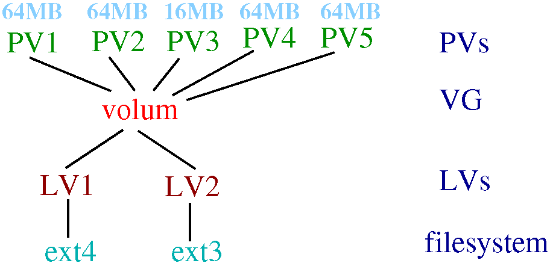
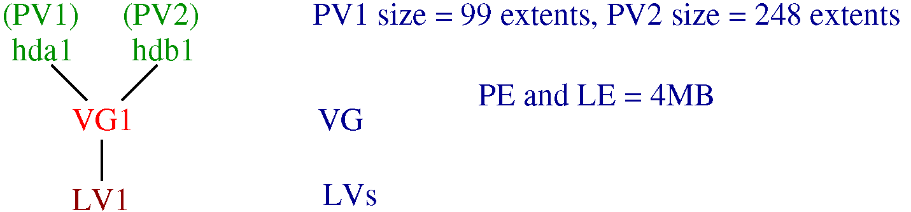

## ANATOMY OF LVM



- VG (Volume Group): gathers together LVs and PVs into one administrative unit.

- PV (Physical Volume): a PV is typically a hard disk (partition), raid device, etc...

- LV (Logical Volume): the equivalent of a disk partition in a non-LVM system. 

- PE (Physical Extent): each PV is divided in chunks of data, known as PEs. These extents have the same size as the LEs.

- LE (Logical Extent): each LV is split into chunks of data, known as LEs.

## Mapping modes (linear/striped)



- We now can create a LV (LV1). 

- LV1 can be any size between 1 and 347 (99+248) extents. 

- When LV1 is created, a mapping is defined between LEs and PEs (eg. LE[i] could map onto PE[i] of PV1 and PE[i] of PV2).

- Strategies for mapping LEs onto PEs:

	1. Linear (similar to RAID Linear) mapping will assign a range of PEs to an area of an LV in order (eg., LE[1 - 99] map onto PV1 and LE[100 - 248] map onto PV2).

	2. Striped (similat to RAID0):

		LE[1] --> PV1[1]

		LE[2] --> PV2[1] 

		LE[3] --> PV1[2] 

		and so on.

## Snapshots

- Snapshots allows the administrator to create a new block device which is an exact copy of a LV, frozen at some point in time. 

- Used when for instance, we need to perform a backup on the LV, but you don't want to halt a live system that is changing the data.

##  Boot time script 

- The startup of LVM requires just the following two commands:

```bash
# vgscan 

vgscan – reading all physical volumes (this may take a while...) 

vgscan – "/etc/lvmtab" and "/etc/lvmtab.d" successfully created

vgscan – WARNING: This program does not do a VGDA backup of your volume group

# vgchange -ay 

```

- And the shutdown only one:

```bash
# vgchange -an 
```

## Startup script (`/etc/init.d/lvm`)

```bash
#!/bin/sh 

case "$1" in

	start)  /sbin/vgscan 

		/sbin/vgchange -ay ;; 

	stop)  /sbin/vgchange -an ;; 

	restart|force-reload)

		/sbin/vgchange -an && /sbin/vgscan && /sbin/vgchange -ay ;; 

esac 

exit 0 
```


##  LVM Files


- /etc/lvmtab

	Informs about the activated VGs

- /proc/lvm/*

	Inform about the VGs structure

- /dev/my_VG[1-n]/*

	LVM device files

