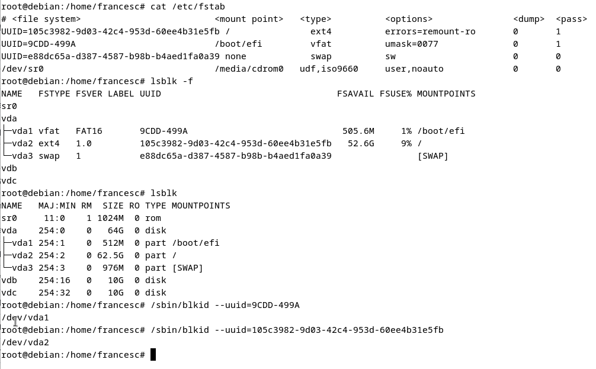

# Muntatge de Sistemes de Fitxers

-  En aquest capítol aprendrem com muntar i desmuntar sistemes de fitxers

## Muntatge Automàtic

- Es correspòn als sistemes de fitxers (s.f.) que es munten de forma automàtica en arrencar-se el sistema 
	(degut a l'execució de la comanda `\# mount -a`) es defineixen en el fitxer `/etc/fstab`:
  
	- Relaciona dispositius (particions) amb punts i opcions de muntatge. 

  	- Columnes (camps) de `/etc/fstab`: 
		dispositiu, 
		punt_de_muntatge, 
		tipus de sistema de fitxers
		opcions, 
		còpia (0 -no-, 1 -si-), 
		xequeig automàtic en muntar-se - `fsck` - (0 -no-, 1-si-).
		
- Opcions més importants:

```bash
 - async. All  I/O  to  the  filesystem  should be done asynchronously. Asynchronous write operations allow 
	      the system to continue executing other tasks without waiting for the data to be physically written to the
              storage device. 

- atime.  Do not use noatime feature, then the  inode  access time is controlled by kernel defaults. 

- noatime.   Do not update inode access times on this filesystem
 
- auto.   Can be mounted with the -a option.

- noauto. Can only be mounted explicitly (i.e., the -a option will not cause the filesystem to be mounted).

- defaults. Use default options: rw,  suid,  dev,  exec,  auto, nouser, and async.

- dev.   Interpret character or block special devices on the filesystem.

- nodev.  Do not interpret character or block special devices on the file system.

- diratime.  Update   directory   inode  access  times  on  this filesystem. This is the default.

- nodiratime.   Do not update directory inode access times on  this filesystem.

- dirsync.  All  directory updates within the filesystem should be done synchronously.  This affects the  following
              system  calls: creat, link, unlink, symlink, mkdir, rmdir, mknod and rename.

- exec.   Permit execution of binaries.

- noexec. Do not allow direct execution of  any  binaries  on the  mounted  filesystem.  

- group.  Allow an ordinary (i.e., non-root)  user  to  mount the  filesystem  if  one  of his groups matches the
              group of  the  device.   

- encryption. Specifies  an encryption algorithm to use.  

- keybits. Specifies the key size to  use  for  an  encryption algorithm.  

- nofail. Do  not  report  errors

- mand.  Allow mandatory locks on this filesystem.
      
- nomand. Do not allow mandatory locks on this filesystem.

- netdev.  The filesystem resides on a  device  that  requires  network  access  

- nofail Do not report errors for this device.

- relatime   Access  time is only updated if the previous access time was earlier than  the  current
              time.  

- norelatime.  Do not use relatime feature. 

- suid.   Allow set-user-identifier  or  set-group-identifier bits to take effect. 
		Setting uid:
             		# chmod u+s program  // setting bit setuid
	     	 	# chmod u-s program  // deleting bit setuid

		Setting gid:
	      		# chmod g+s program  // setting bit setgid
	      		# chmod g-s program  // deleting bit setuid

- nosuid. Do not allow set-user-identifier or set-group-identifier bits to take effect. 

- silent. Turn on the silent flag. Suppress the display of 
	      certain (printk()) warning messages in the kernel log

- loud.   Turn off the silent flag.

- owner.  Allow an ordinary (i.e., non-root)  user  to  mount the  filesystem  if  he is the owner of the device.
 
- remount.  Allows  remounting an  already-mounted  filesystem.

- ro.     Mount the filesystem read-only.

- rw.     Mount the filesystem read-write.

-  sync.   All  I/O  to  the  filesystem  should  be done synchronously. 

- user.   Allow an ordinary user  to  mount  the  filesystem.

- nouser. Forbid  an  ordinary (i.e., non-root) user to mount
              the filesystem.  This is the default.

```


- Comandes més importants:

	- Per muntar els dispositius que encara no estiguin muntats: 
	
	```bash
	# mount -a    /* els munta tots */
	```

	- Per muntar tots els sistemes de fitxers del tipus `tipus_sf`	

	```bash
	# mount -a -t tipus_sf
	```

	Exemple:
	
	

## Muntatge No Automàtic

- Es correspòn al muntatge de s.f. que no estan definits en`/etc/fstab`

- Comandes més importants:

	```bash
	# mount -t tipus_sf dispositiu lloc
	```
	
	Exemple:
	```bash
	# mount -t vfat /dev/hda1 /tmp
	```


## Desmuntatge (Automàtic i no Automàtic)

- Llistant els dispositius (s.f.) muntats:

	```bash
	# mount 
	```
	Exemple (Debian 12 (UTM):
	```bash
	# mount | grep /dev/vda
	/dev/vda2 on /            type ext4 (rw,relatime,errors=remount-ro)
	/dev/vda1 on / boot/efi   type vfat  (rw,relatime,errors=remount-ro,utf8,.....)
	```


- Per desmuntar un dispositiu o s.f.: 

	```bash
	# umount [dispositiu | lloc]
	```
	Exemple:
	```bash
	# umount /dev/hda1
	```
	o bé (és equivalent):
	```bash
	# umount /tmp
	```
	