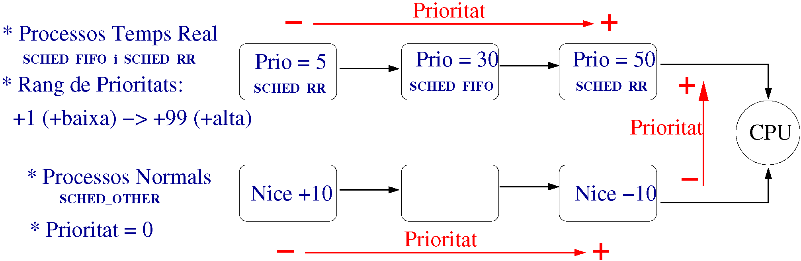

## Temps Real


###  Esquema Planificador de Linux




###  Polítiques de planificació: 

- SCHED_FIFO: FIFO (molt perillós) 

- SCHED_RR: Round Robin

- SCHED_OTHER: Round Robin però quan tots els processos han gastat 1 Quantum (210ms) es replanifica de nou tornant a donar a tots els processos 1 Quantum més d'execució. Assegura que cap procés entri en inanició.


### Crides a sistema 


• Modificar la política i prioritat de planificació d'un procés: 

```bash
int sched_setscheduler(pid_t pid, int politica, const struct sched_param *p);
```

• Obtenció de la política de planificació d'un procés: 

```bash
int sched_getscheduler(pid_t pid); // retorna la política de planificació 
```

• Obtenció de la prioritat de planificació d'un procés:

```bash
int sched_getparam(pid_t pid, const struct_param *param); 
```

• Obtenint la prioritat màxima i mínima d'una política de planificació: 

```bash
int sched_get_priority_max(int politica);

int sched_get_priority_min(int politica); 
```

• Abandonar la CPU: 

```bash
int sched_yield(void);
```