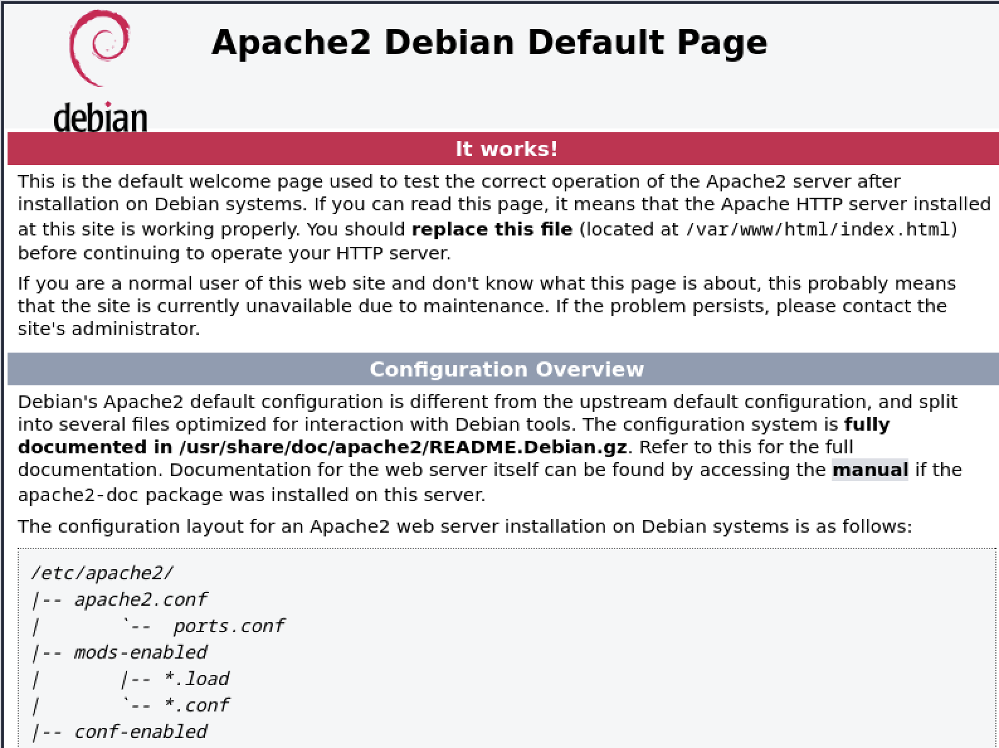

# Instal·lant i configurant Apache

El primer pas per desplegar un servidor web amb **WordPress** és instal·lar i configurar un servidor web. Necessitem la versió 2.4 o superior d'**Apache** per a la nostra instal·lació. 

1. Instal·lem el paquet apache2:

    ```sh
    # apt install apache2
    ```

2. Comprovem l'estat del servei amb `systemctl`:

    ```sh
    # systemctl status apache2
    ```

3. Visualitzem els fitxers de configuració del servei *apache2*:

    ```sh
   #  less /usr/lib/systemd/system/apache2.service
    ```

4. Habilitar el servei per iniciar cada cop que el sistema arranqui:

    ```sh
    # systemctl enable apache2
    ```

5. Arranqueu i comproveu l'estat del servei:

    ```sh
   #  systemctl start apache2
    # systemctl status apache2
    ```

Un cop aixecat el servei, podem comprovar que el servei està en marxa i funcionant correctament. Intenteu accedir al servidor web amb la vostra **IP** a través d'un navegador web. En el meu cas, la IP del servidor és **:192.168.64.11**. Recordeu que per veure la IP del vostre servidor podeu utilitzar la comanda `ip a` o `/sbin/ifconfig`.



