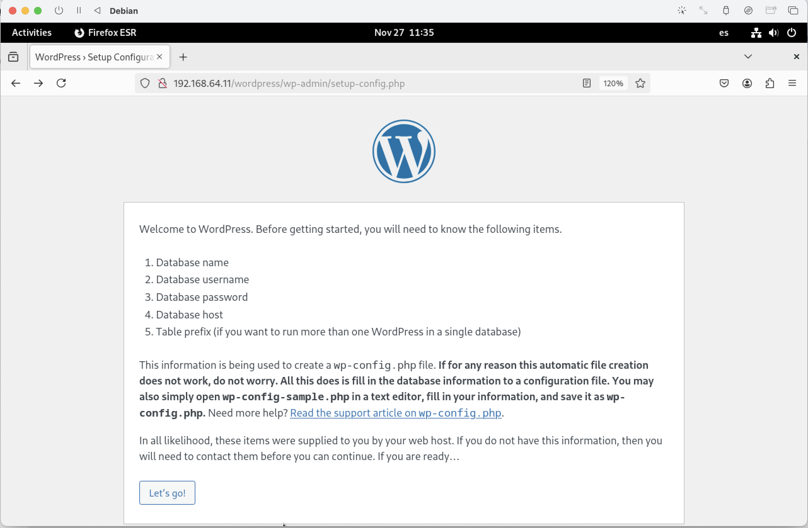
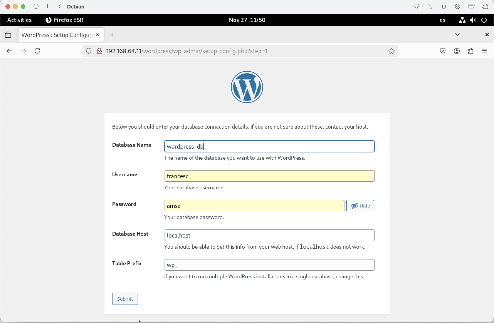
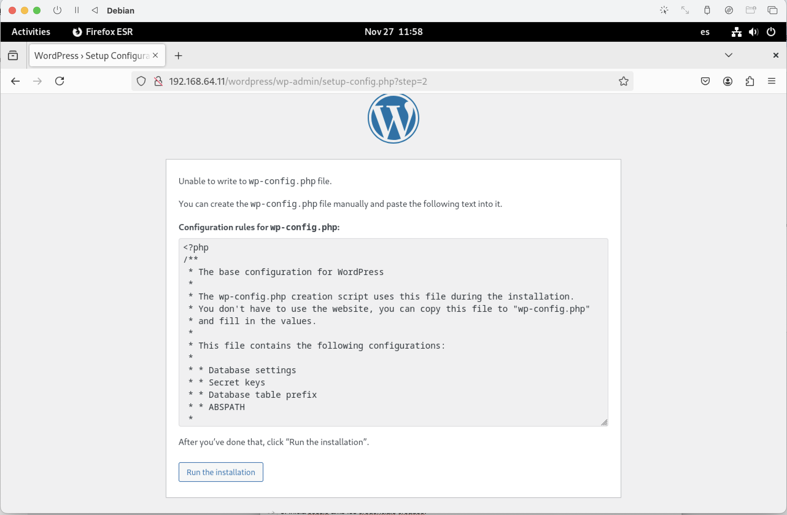
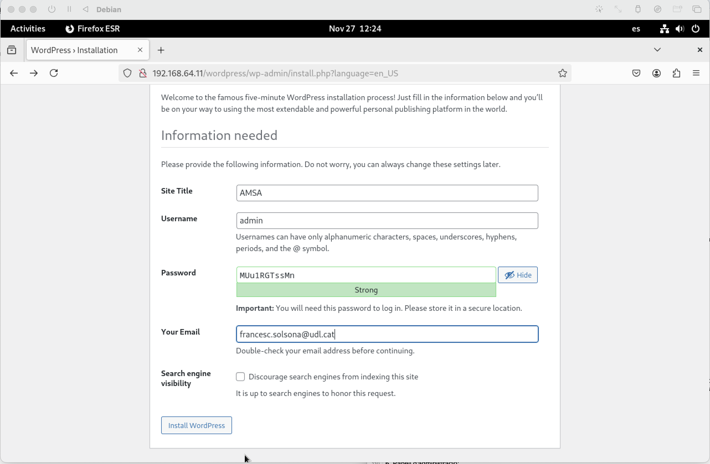
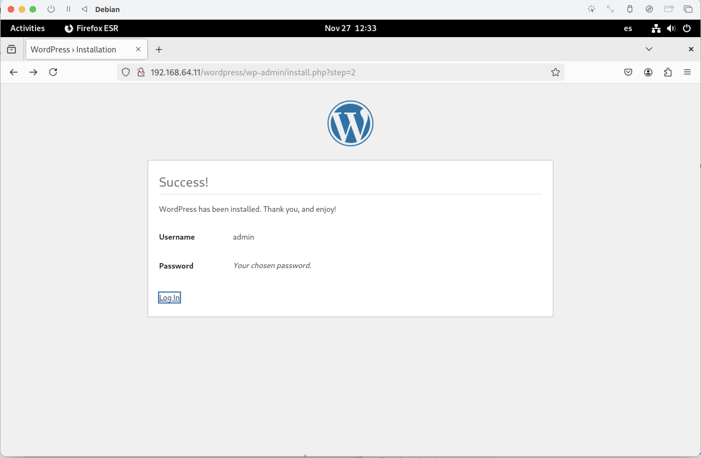
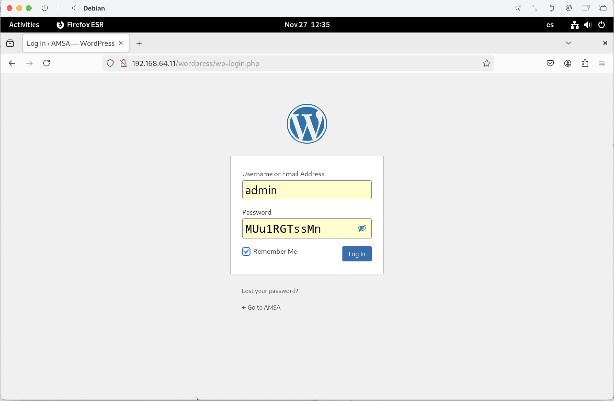
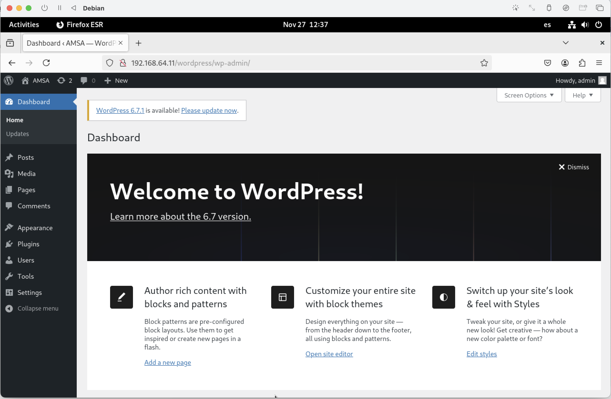
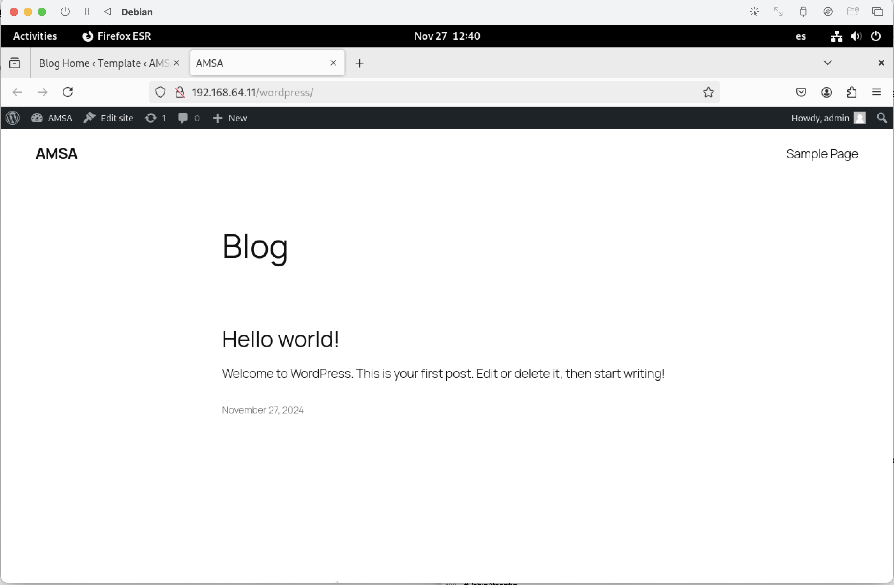

# Instal·lant i configurant Wordpress

Per instal·lar **WordPress** ens hem de baixar el paquet de la web oficial. Per fer-ho podem utilitzar la comanda `wget` per descarregar el paquet de **WordPress**.

1. Instal·lem el paquet **wget**:

    ```bash
    # apt install wget -y
    ```

2. Descarreguem el paquet de **WordPress**:

    Es una bona pràctica utilitzar el directori temporal (*/tmp*) per descarregar el programari a instal·lar com el *Wordpress*. L'ús d'aquest directori ens proporciona:

   * **Espai de disc temporal**: Ubicació on es poden emmagatzemar fitxers sense preocupar-se pel seu ús posterior. És una ubicació amb prou espai de disc disponible, generalment, i sol estar netejada periòdicament pels sistemes operatius per evitar l'acumulació de fitxers temporals innecessaris.

   * **Evitar problemes de permisos**: El directori temporal (*/tmp*) sol tenir permisos que permeten a tots els usuaris crear fitxers temporals sense problemes de permisos. Això és important quan estàs treballant amb fitxers que poden ser manipulats per diversos usuaris o processos.

   * **Seguretat**: Com que el directori temporal és netejat periòdicament, hi ha menys risc de deixar fitxers temporals sensibles o innecessaris al sistema després d'una operació. Això ajuda a prevenir la acumulació de residus i a minimitzar els problemes de seguretat relacionats amb fitxers temporals.

   * **Evitar col·lisions de noms de fitxers**: Utilitzant el directori temporal, es redueixen les possibilitats de col·lisions de noms de fitxers. En altres paraules, si molts usuaris estan descarregant fitxers a la mateixa ubicació, utilitzar el directori temporal ajuda a garantir que els noms de fitxers siguin únics.

   En resum, garanteix l'espai, la seguretat i la gestió adequats per a aquest tipus de fitxers, com és el cas de la descàrrega i descompressió de paquets com WordPress.

    ```bash
    # cd /tmp
    # wget https://wordpress.org/latest.tar.gz -O wordpress.tar.gz
    ```

3. Després d'haver descarregat el paquet, el descomprimim amb la comanda `tar`:

    ```bash
    # apt install tar -y
    # tar -xvf wordpress.tar.gz
    ```

4. Copiem els continguts a la carpeta del servidor **Apache**:

    ```bash
    # cp -R wordpress /var/www/html/
    ```

5. Editem fitxer de configuració del servidor web, normalment a */etc/httpd/conf/httpd.conf*.

    ```bash
    # less /etc/httpd/conf/httpd.conf
    ```

6. Reiniciem el servei **Apache**:

    ```bash
    # systemctl restart apache2
    ```

## Instal·lació del Wordpress

Accediu a la instal·lació web de **WordPress** navegant a [http://192.168.64.11/wordpress/](http://192.168.64.11/wordpress/). On *192.168.64.11* és la ip del meu servidor. Canvieu-la per la vostra ip. 

Per obtenir la `ip`, fer:

```bash
# /sbin/ifconfig
```

1. Inici de la configuració.

    

- Premeu `Let's go!`

2. Introdueix les dades de la base de dades.

    
    
- Premeu `Submit`
    
3.  Si al prémer `Submit` falla.
Apareixerà una pantalla com aquesta:

    

- Això és degut a que no està ben configurat l'usuari que arrenca l'http (normalment, és un usuari anometant `apache2`. 

- Llavors:
	- Copieu el que us apareix a la pantalla al fitxer `/var/www/html/wordpress/wp-config.php`.
	- Premeu `Run the Installation`
    
4. Configuració del lloc web.

    

- Prémer `Install WordPress` per continuar amb la instal·lació
  
5. Inicia sessió amb les credencials creades.

    

- Prémer: `Log In`

6. Panell d'administració.

    

- Prémer: `Log In``
    
7. Visualització del lloc web.

   
En aquest punt tenim 2 accessos al nostre servidor web. Un és el panell d'administració de **WordPress** i l'altre és el lloc web en si mateix:

* **Panell d'administració**: [http://ip/wordpress/wp-admin/](http://ip/wordpress/wp-admin/). En el nostre cas: [http://192.168.64.11/wordpress/wp-admin/](http:/192.168.64.11//wordpress/wp-admin/)

 

* **Lloc web**: [http://ip/wordpress/](http://ip/wordpress/). En el nostre cas: [http://192.168.64.11/wordpress/](http://192.168.64.11/wordpress/)

    

- Intercanviarem el `Panell d'administració`i el `Lloc web`, prement `AMSA`.